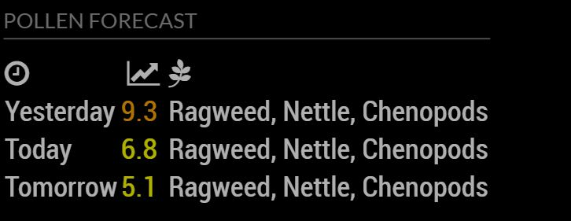

# MMM-Pollen
MagicMirror module to get the pollen.com forecast for your zipcode

## Preview


## Using the module
Go to your MagicMirror modules directory by entering `cd MagicMirror/modules`

run `git clone https://github.com/vincep5/MMM-Pollen`

run `cd MMM-Pollen` to get into the newly created folder

run `npm install` to install the dependencies

Add `MMM-Pollen` module to the `modules` array in the `config/config.js` file:
````javascript
modules: [
  {
    module: "MMM-Pollen",
    position: "top_left",
    header: "Pollen Forecast",
    config: {
        updateInterval: 3 * 60 * 60 * 1000, // every 3 hours
        zip_code: "90210"
    }
  },
]
